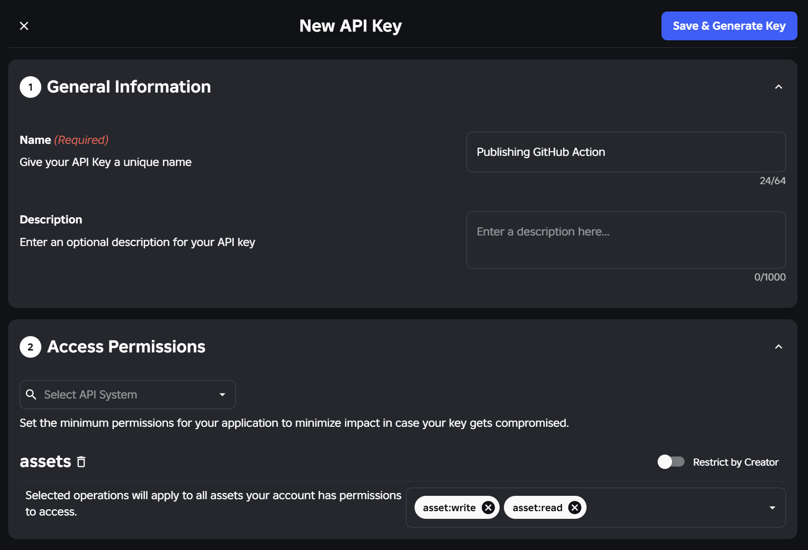

# Update Roblox Asset

GitHub Action for updating assets on Roblox.

Uses [Open Cloud](https://create.roblox.com/docs/cloud) to update the asset on Roblox and then polls the operation status for the result.

## Usage

```yaml
- uses: ryanlua/update-roblox-asset@v0.1.0
  with:
    api-key: ${{ secrets.OPEN_CLOUD_API_KEY }}
    asset-id: 13947506401
    file: model.rbxm
```

## Inputs

| Input          | Required | Description                                                   |
| -------------- | -------- | ------------------------------------------------------------- |
| `api-key`      | Yes      | Open Cloud API key with `asset:read` and `asset:write` scopes |
| `asset-id`     | Yes      | ID of the asset to update                                     |
| `file`         | Yes      | Path to `.rbxm` or `.rbxmx` asset file                        |
| `display-name` | No       | New display name for the asset                                |
| `description`  | No       | New description for the asset                                 |

## Outputs

| Output         | Description           |
| -------------- | --------------------- |
| `operation-id` | ID of asset operation |

## Open Cloud API Key

An [Open Cloud API key](https://create.roblox.com/docs/cloud/auth/api-keys) with `asset:read` and `asset:write` scopes is required to use thie GitHub Action in order to update assets.

To create and configure an API key with the required permissions:

1. In the [Creator Dashboard](https://create.roblox.com/dashboard/creations), go to the [API Keys](https://create.roblox.com/dashboard/credentials?activeTab=ApiKeysTab) page.
1. Click the **Create API Key** button.
1. Enter a name for the API key, such as `Publishing GitHub Action`.
1. In the **Access Permissions** section, select the `assets` API from the **Select API System** menu.
  It is strongly recommended to enable **Restrict by Creator** to the owner of the asset you want to update.
1. From the **Select Operations** dropdown, select `read` and `write`.
1. **(Optional)** If you're using [self-hosted runners](https://docs.github.com/actions/hosting-your-own-runners/about-self-hosted-runners), in the **Security** section, you can restrict IP access to the IP of your self-hosted runner machine by adding it to the **Accepted IP Addresses**.
1. Click the **Save & Generate key** button.



Once you have your API key, add it as a [secret on GitHub](https://docs.github.com/en/actions/how-tos/write-workflows/choose-what-workflows-do/use-secrets) so the action can use your API key to update your assets.
